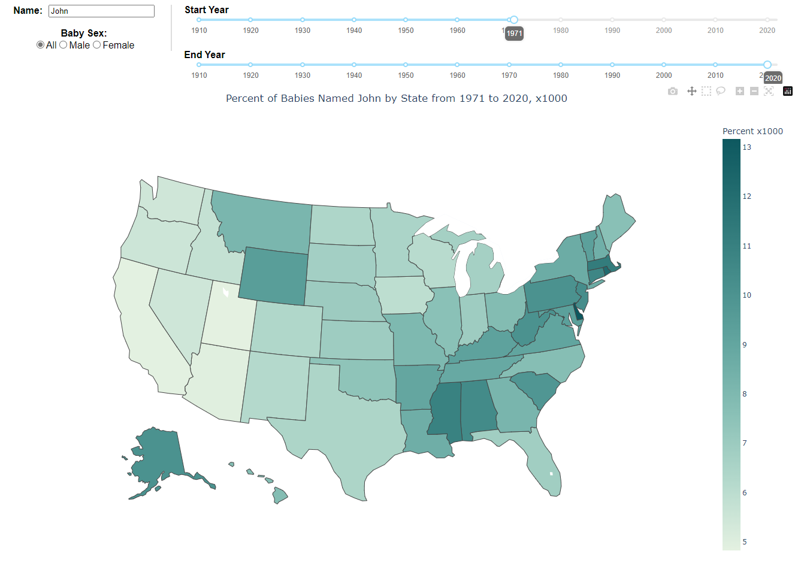

# Baby Names Heatmap

I built this Plotly Dash App to interactively view the frequency of baby names by state, sex, and year. I love naming trends, but I thought the [SSA baby names website](https://www.ssa.gov/oact//babynames/index.html) left something to be desired. You could only look at the 1000 most popular names in a year, and there was no way to geographically visualize a name's popularity. Luckily, the SSA will provide the [state-specific data](https://www.ssa.gov/oact//babynames/limits.html).

This is my first time using Dash, and I used Bing AI to help with some of the Dash HTML coding. I think the result is pretty cool!
